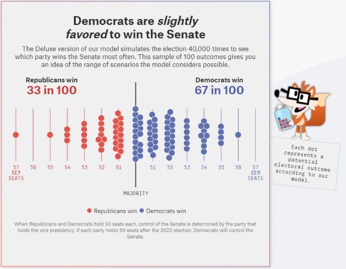
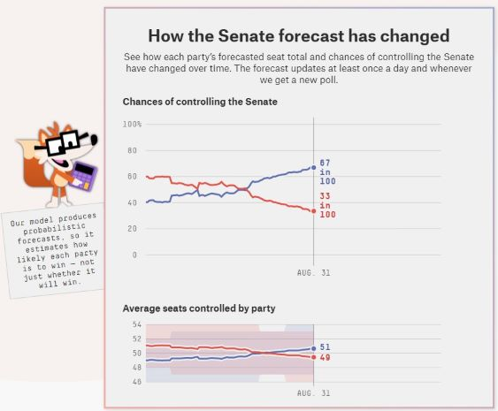

The website FiveThirtyEight uses data to make predictions about the outcomes of upcoming elections. Building a model of an election is difficult and complicated; but an even *bigger* challenge for the FiveThirtyEight team is finding ways to present predictions from this complicated model to non-experts. As you work through this assignment, view the different sections of the FiveThirtyEight 2022 Senate elections model [at this link.](https://projects.fivethirtyeight.com/2022-election-forecast/senate/)

Data presentation is all about decisions. Our goal in this exercise is to understand the decisions that went into each piece of the FiveThirtyEight election forecast visualization. For each visualization, the team has to decide which aspects of the model to include or exclude. (You can read about some of these decisions from the authors themselves [here.](https://fivethirtyeight.com/features/how-we-designed-the-look-of-our-2020-forecast/))

Note that we won't be making any visualizations of our own in this lab. Instead, we will evaluate the ways that FiveThirtyEight chooses to visualize and present the outcome of their elections model. This will give us practice *thinking* about data visualization. This is also a chance to practice using Markdown to communicate about data. (Even though we won't be doing any actual coding... yet.)

## Instructions

Change the author of the document to your name and change the date to today's date. Then, insert your answers to the questions below. You should follow along on [the FiveThirtyEight website](https://projects.fivethirtyeight.com/2022-election-forecast/senate/) as you complete the assignment; sometimes the visualizations have interactive functionality that is not captured in the images below.

When you are finished, compile the document as an HTML file and turn it in by uploading it to github. (You can make your github public or private.) Make sure to check your finished markdown document carefully before turning it in!

## Evaluating the FiveThirtyEight Model Presentation

---

#### The Bee Swarm
{width=40%}

---

##### Question 1

List **two aspects** of the election forecast that the bee swarm shows. What visual elements does it use to show these things?

[your answer here.]

##### Question 2

List **two aspects** of the election forecast that the bee swarm does *not* show.

---

#### The News Panel
{width=40%}

---

##### Question 3

List **two aspects** of the election forecast that the news panel shows. What visual elements does it use to show these things?

##### Question 4

List **two aspects** of the election forecast that the news panel does *not* show.

---

#### The Map View
{width=40%}

---

##### Question 5

List **two aspects** of the election forecast that the map view shows. What visual elements does it use to show these things?

##### Question 6

List **two aspects** of the election forecast that the map view does *not* show.

---

#### The Histogram
{width=40%}

---

##### Question 7

List **two aspects** of the election forecast that the histogram shows. What visual elements does it use to show these things?

##### Question 8

List **two aspects** of the election forecast that the histogram does *not* show.

---

#### The Line Chart
{width=40%}

---

##### Question 9

List **two aspects** of the election forecast that the line chart shows. What visual elements does it use to show these things?

##### Question 10

List **two aspects** of the election forecast that the line chart does *not* show.

---

#### The State-by-State View
{width=40%}

---

##### Question 11

List **two aspects** of the election forecast that the state-by-state view shows. What visual elements does it use to show these things?

##### Question 12

List **two aspects** of the election forecast that the state-by-state view does *not* show.

